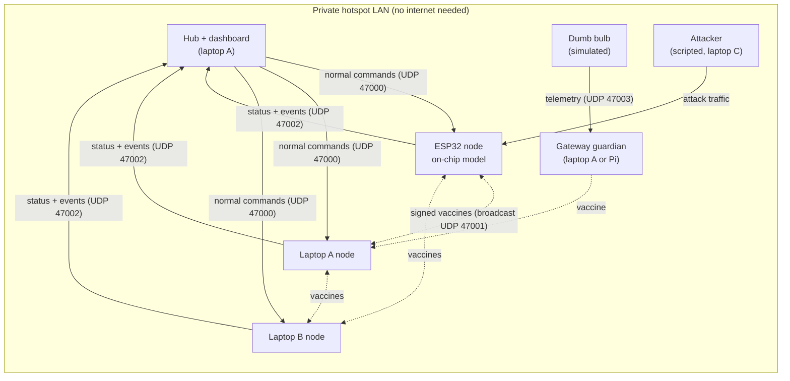
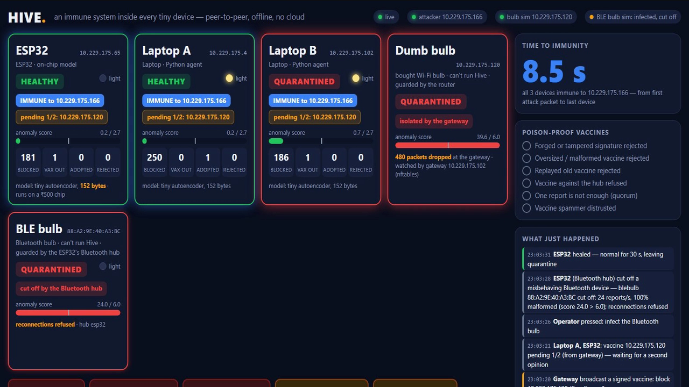

# Hive Immunity System

[](https://github.com/prayag-1771/Hive-Immunity-System/actions/workflows/ci.yml)

**A digital immune system for IoT devices.** Smart devices detect attacks with a tiny
on-device model, quarantine themselves, and share signed **vaccines** ("block this
sender") so their neighbours block the attacker *before it reaches them*. Dumb devices
that cannot run our code (bulbs, plugs, cameras) are protected by the router/gateway,
which quarantines them.

Peer-to-peer. Offline. No cloud. Runs on a ₹500 ESP32.

> Big companies buy an immune system for their network. We put one inside every tiny
> device — so they protect each other, with no cloud and no expensive box.


**Pitch deck:** [docs/Hive-pitch.pptx](docs/Hive-pitch.pptx) (11 slides with speaker notes) ·
**Backup video:** [docs/demo-backup-hardware.mp4](docs/demo-backup-hardware.mp4) (61 s, all 8 steps on
the real ESP32 + Raspberry Pi + laptop; re-record with `python tools/record_dashboard.py`)

---

## The problem

- About **21.1 billion** connected IoT devices by the end of 2025. Most are "dumb"
  (bulbs, plugs, cameras, sensors) with no antivirus and rare updates.
- Hijacked devices power record botnets. **Aisuru** is estimated at **1–4 million**
  compromised devices (home IoT, video recorders, routers), spreading mainly through
  outdated firmware and default passwords, and has launched record DDoS attacks
  (**31.4 Tbps**).
- New laws only fix **future** devices: the UK banned default passwords in 2024, and the
  EU Cyber Resilience Act's main obligations apply from December 2027. Billions of devices
  already deployed stay exposed.
- Enterprise "immune system" products (e.g. Darktrace's *Enterprise Immune System*) learn
  normal behaviour and flag anomalies, but they are expensive network/cloud appliances. A
  home, shop, farm or small factory can't afford them, and they don't run **inside** cheap
  devices.
- When one cheap device is attacked today, **its neighbours learn nothing**. The attacker
  simply moves on to the next one.

## The idea

| Body | Hive |
|---|---|
| Cells know what "normal" looks like | Each device runs a tiny model that learns its own normal traffic |
| An infected cell isolates itself | The device enters **quarantine** and only trusts known senders |
| Immune memory and vaccines | The device broadcasts a signed **vaccine**: "block sender X" |
| Others become immune before infection | Neighbours add X to their block list in advance |
| Protection against autoimmunity | Devices that spam vaccines lose trust |

One system covers three kinds of device:

1. **Smart devices** (ESP32, or anything that runs Hive) protect themselves on-device.
2. **Dumb Wi-Fi devices** are watched by the **gateway**, which learns each device's
   normal behaviour and isolates a misbehaving one. In a real deployment this runs on an
   OpenWrt router; in the demo a laptop or Raspberry Pi plays the router.
3. **Bluetooth devices** are watched by a **Bluetooth hub** (here the ESP32 itself). It
   learns each device's normal reporting, cuts a misbehaving one off the radio and refuses
   to let it reconnect until an operator reset.

### Poison-proof vaccines

"Can't the vaccine itself be hacked?" Every defence below is implemented and shown live in
the demo's *Attack the cure* step:

- **Data only, fixed schema, size-limited** (≤ 300 bytes, checked before parsing). A
  vaccine is never code and never free text that gets executed.
- **Block-only.** A vaccine can only *add* a block rule. It can never unblock, open
  anything, change config or update firmware. The worst a fake vaccine can do is cause a
  temporary unnecessary block, never a takeover.
- **Signed** by the issuing device (HMAC-SHA256). Forged or tampered vaccines are rejected.
- **Replay-protected** with a strictly increasing sequence number per issuer.
- **Second opinion (quorum):** a device adopts a vaccine from others only when **two
  different issuers** report the same target. Its own detection is enough for itself.
- **Rate-limited (autoimmune):** an issuer that sends too many vaccines is distrusted for
  a while, and its pending votes are dropped.
- **Expiry (TTL):** blocks expire, so mistakes heal on their own.
- **Protected targets:** no vaccine can target the hub/gateway or the receiving device.

### What is new, honestly

- **Not new:** learning normal behaviour and quarantining devices at network level
  (Darktrace, Firewalla, IoT Sentinel).
- **New:** the immune system lives **inside cheap devices**, devices **vaccinate each other
  peer-to-peer, offline, with no cloud**, and the vaccines are **poison-proof**. A 2025
  review notes that collaborative intrusion detection has not yet been implemented on
  resource-constrained devices.

---

## Architecture



**Every node, every second:** count the inbound messages and compute five features:
messages per second, distinct senders, unknown-sender ratio, malformed ratio and mean
size. While **learning** (the first 20 s of hub traffic) it records the mean and spread of
each feature and which senders are normal. After that it **scores** each window: by
default the largest z-score, or with the trained model, the reconstruction error of a tiny
5→3→5 autoencoder. Two anomalous windows in a row mean **quarantine**:

1. Block the culprit (the busiest unknown sender in the window).
2. Broadcast a signed vaccine against it.
3. Only trust known senders until things have been calm for 30 s.

**Every vaccine received** goes through the cheapest checks first: size → schema →
issuer known and not distrusted → sequence number → signature → rate limit → protected
target → quorum. Every rejection is counted and shown on the dashboard.

The same logic exists twice, and the tests keep the two in step:
[agent/hive_core.py](agent/hive_core.py) for laptops, and
[firmware/hive_node/hive_node.ino](firmware/hive_node/hive_node.ino) for the ESP32.

| Message | Direction | Purpose |
|---|---|---|
| `cmd` | hub → node | normal traffic: `ping`, `light_on`, `light_off`, `status` |
| `status` | node → dashboard, 1 Hz | state, score, features, counters, block list, pending votes |
| `event` | node → dashboard | quarantine, vaccine issued/adopted/rejected, healed, first packet blocked |
| `vax` | node → broadcast | `{issuer, seq, rule:"block", target, ttl, reason, sig}` |
| `ctrl` | dashboard → node | signed `reset` / `relearn` |

All messages are compact JSON over UDP. A vaccine's signature is
`HMAC-SHA256(issuer key, JSON without sig, sorted keys, no spaces)`, and a fixed test
vector checks the Python and C implementations against `openssl`.

### The gateway (Wi-Fi devices that can't run Hive)

[gateway/guardian.py](gateway/guardian.py) runs on the router. For each device it learns
the normal message rate and number of destinations. When a device suddenly floods (a bulb
recruited into a botnet), the gateway quarantines it:
- **always:** app-level, so the gateway stops accepting and relaying its traffic;
- **on a Linux gateway, with `--nft`:** the device's address also goes into an nftables set
  that drops its traffic ([gateway/nft_rules.nft](gateway/nft_rules.nft)).

It also broadcasts a signed vaccine, which warns the Hive nodes.

### The Bluetooth hub (Bluetooth devices that can't run Hive)

The ESP32 doubles as a Bluetooth hub ([firmware/hive_node/ble_hub.h](firmware/hive_node/ble_hub.h)).
It advertises a small BLE service that Bluetooth devices connect to and report to every
few seconds (`blebulb:42:1`). For each device it learns the normal report rate and the
share of malformed reports. When a device starts flooding or sending junk, the hub:
1. cuts the radio link (`esp_ble_gap_disconnect`), and
2. refuses every reconnection from that Bluetooth address until a signed reset.

In the demo the Raspberry Pi plays the Bluetooth bulb ([tools/ble_bulb.py](tools/ble_bulb.py),
using bleak).

### Safety built into the code

Every program refuses to send anything outside the machine's own local network segment,
using the operating system's routing table. If a laptop drops off the demo hotspot and
rejoins a campus Wi-Fi, Hive goes quiet instead of leaking traffic, and the attacker tool
can't be aimed at a real host.

---

## Quick start: the whole demo on one laptop

Python 3.10+ and nothing else. No internet needed.

```sh
python tools/provision_keys.py        # once: generates keys + configs (gitignored)
python tools/run_local.py --open      # dashboard at http://localhost:8080
```

`run_local.py` starts the dashboard and hub, three immune nodes (an ESP32 stand-in,
Laptop A, Laptop B), the gateway guardian, a dumb bulb and the attacker. Each one gets its
own `127.0.0.x` address, so blocking by sender address works exactly as on a real
network. Wait about 20 s for the tiles to turn green, then use the buttons or keys
`1`–`3`, `b`, `c`, `r`.

Run the tests:

```sh
python -m pytest tests                 # Python core: detection + every vaccine defence
sh firmware/test/run_host_test.sh      # ESP32 firmware on a PC (Linux/WSL, needs g++ + OpenSSL)
```

## Real hardware demo

| Device | Role | Runs |
|---|---|---|
| ESP32 | smart node with on-chip model | `firmware/hive_node` |
| Laptop A (Linux preferred) | gateway + node + dashboard/hub | `setup_hotspot.sh`, `guardian.py`, `hive_agent.py --node lapA`, `dashboard/server.py` |
| Laptop B | second smart node (gives a real quorum of 2) | `hive_agent.py --node lapB` |
| Laptop C or Raspberry Pi | attacker + dumb bulb | `scenarios.py serve`, `dumb_device.py` |

1. **Hotspot** on the gateway (2.4 GHz, because the ESP32 has no 5 GHz):
   `sudo sh gateway/setup_hotspot.sh HiveNet <password>`. A phone hotspot also works; then
   run the guardian without `--nft`. Never use venue Wi-Fi.
2. **Keys:** `python tools/provision_keys.py --ssid HiveNet --password <password> --led-pin 2`,
   then copy `config/nodes.json` to every laptop (the keys are the same everywhere).
3. **ESP32:** open `firmware/hive_node/hive_node.ino` in Arduino IDE (ESP32 core 3.x,
   ArduinoJson 7, *Tools → Partition Scheme → Huge APP*, because Wi-Fi plus the Bluetooth hub
   needs more than the default 1.3 MB) or use arduino-cli, then flash it. Its LED blinks slowly while learning,
   follows the hub's light commands when healthy, and blinks fast when quarantined.

   ```sh
   arduino-cli core install esp32:esp32 --additional-urls https://espressif.github.io/arduino-esp32/package_esp32_index.json
   arduino-cli lib install ArduinoJson
   arduino-cli compile --fqbn esp32:esp32:esp32:PartitionScheme=huge_app firmware/hive_node
   arduino-cli upload  --fqbn esp32:esp32:esp32:PartitionScheme=huge_app -p COM5 firmware/hive_node   # or /dev/ttyUSB0
   arduino-cli monitor -p COM5 -c baudrate=115200
   ```
4. **Start the roles** with one command per machine ([tools/hive_up.py](tools/hive_up.py)):
   - Laptop A: `python tools/hive_up.py dashboard node:lapA gateway --http 0.0.0.0`
     (add `--nft` and run it as root on a Linux gateway)
   - Laptop B: `python tools/hive_up.py node:lapB`
   - Laptop C: `python tools/hive_up.py attacker bulb --gateway <laptop-A-ip>`
   - Bluetooth bulb (Linux with bleak): `python tools/hive_up.py blebulb`
5. Open the dashboard on the projector and wait for all the tiles to turn green.

Baselines are saved (Python: `data/state/`, ESP32: flash), so restarts skip learning.

### Tested setup: one laptop, one Raspberry Pi, one ESP32

This is the configuration verified end to end on real hardware, on a phone hotspot
(2.4 GHz, WPA2):

| Device | Roles | How it starts |
|---|---|---|
| Laptop (Windows) | dashboard + hub, Laptop A node | double-click [deploy/windows/start-laptop-A.cmd](deploy/windows/start-laptop-A.cmd) |
| Raspberry Pi 5 | Laptop B node, gateway (nftables), attacker, Wi-Fi bulb, Bluetooth bulb | automatically at boot (hive-pi service) |
| ESP32 DevKit (CP2102) | on-chip node + Bluetooth hub | flashed once, joins the hotspot by itself |

All 8 demo steps pass on this setup: the ESP32 quarantines itself in about 2 s, every
device is immune in about 5 s, Laptop A blocks the attacker's first packet, the Pi's
nftables set isolates the Wi-Fi bulb, the ESP32's Bluetooth hub cuts off the flooding
Bluetooth bulb in about 2 s, every poisoned vaccine is rejected, and Reset heals
everything. Gemma 4 explains the run offline in about 10 s.

The attacker and the bulb must not share an address with a node, so the Pi gives itself
two extra temporary addresses. At every boot, [deploy/pi/hive-pi.sh](deploy/pi/hive-pi.sh)
does the following:
1. waits for the hotspot;
2. picks two free addresses in its subnet (checked with `arping`) and adds them;
3. loads the nftables rules and starts all the Pi's roles;
4. starts over if the hotspot later hands out a different subnet.

One-time install on the Pi (after copying `config/nodes.json` there):

```sh
git clone https://github.com/prayag-1771/Hive-Immunity-System && cd Hive-Immunity-System
sudo sh deploy/pi/install.sh          # venv + bleak, enables hive-pi.service
journalctl -u hive-pi -f              # watch it
```



Before every demo run, press **Reset** (blocks last 5 minutes, and a node that already
blocks the attacker silently drops the attack). If a device was attacked while it was
learning, press **Relearn**.

### Smaller setups

- **No third laptop:** the Raspberry Pi takes the attacker and dumb-bulb roles. The
  attacker must not share an address with the hub or a node, so it can't run on Laptop A
  or Laptop B.
- **Only two immune nodes** (e.g. the ESP32 and Laptop A): provision with `--quorum 1`, so
  one report is enough. Attacking the ESP32 then makes Laptop A immune straight away, and
  attacking Laptop A shows *blocked instantly*.
- **Pi as the hotspot too:** Raspberry Pi OS (Bookworm and later) uses NetworkManager, so
  `setup_hotspot.sh` works there unchanged. All traffic then passes through the Pi, so the
  nftables quarantine also cuts the bulb off the internet.

### Troubleshooting

- **A Windows laptop never shows up, or is stuck on "waiting for hub":** the Windows
  firewall is dropping UDP. Accept the "allow Python" prompt for *Private* networks and
  set the hotspot network's profile to Private.
- **The ESP32 doesn't appear:** it only joins 2.4 GHz Wi-Fi. Open the serial monitor at
  115200 baud: it prints its IP address, and typing `s` prints its state.
- **No COM port when the ESP32 is plugged in:** Device Manager shows "CP2102 USB to UART
  Bridge Controller" with error 28, so the USB-serial driver is missing. Install Silicon
  Labs' CP210x driver; the same WHQL-signed package is on the Microsoft Update Catalog
  (search `VID_10C4&PID_EA60`). A board that shows nothing at all usually has a
  charge-only cable.
- **Upload or read fails part-way ("packet content transfer stopped"):** the USB link
  can't hold 921600 baud. Flash at a lower speed:
  `arduino-cli upload --fqbn esp32:esp32:esp32:PartitionScheme=huge_app,UploadSpeed=115200 -p COM3 firmware/hive_node`.
- **False alarms after moving to a new network:** press **Relearn** (or type `r` on the
  ESP32's serial monitor) so every node learns the new normal.
- **A screen or proxy that breaks live updates:** open `http://<dashboard>:8080/?poll`,
  which polls instead of streaming.

## Demo script (about 3–4 minutes)


| Step | Press | What the judges see |
|---|---|---|
| 1 | — | Green tiles: ESP32, Laptop A, Laptop B and the dumb bulb. "Everything is normal." |
| 2 | **Attack ESP32** | The ESP32 turns red and its LED blinks fast. A vaccine flies to the others, which show *pending 1/2*. |
| 3 | **Attack Laptop B** | Laptop B detects the attack and sends a second vaccine. Laptop A reaches quorum and turns **immune**. *Time to immunity* stops. |
| 4 | **Attack Laptop A** | **BLOCKED INSTANTLY**: the first packet is dropped and no quarantine is needed. |
| 5 | **Infect dumb bulb** | The gateway sees the bulb flooding and the bulb turns red: *isolated by the gateway*. |
| 6 | **Infect BLE bulb** | The Bluetooth bulb floods the ESP32's Bluetooth hub, gets *cut off by the Bluetooth hub*, and every reconnection is *refused*. |
| 7 | **Attack the cure** | Forged, tampered, oversized, replayed, hub-targeting and spammed vaccines are all rejected, and the checklist lights up. |
| 8 | **Reset** | Everything heals back to green without restarting. |

Let a judge press the attack button. Keyboard: `1`–`3` attack, `b` dumb bulb, `t`
Bluetooth bulb, `c` attack the cure, `r` reset, `e` explain.

**Explain incident** asks Gemma 4 running locally through Ollama to narrate what happened
in plain language, with no cloud involved. If no model is reachable, it falls back to a
template sentence:

```sh
ollama pull gemma4:e2b-it-qat     # smallest Gemma 4 build (4.3 GB); runs on a laptop GPU or CPU
ollama serve                      # the dashboard calls http://127.0.0.1:11434
```

## Honest limits

- Hive **contains** infected dumb devices; it doesn't clean them.
- An attacker who carefully mimics normal traffic can slip through. The model only knows
  "normal versus not normal".
- The demo identifies senders by IP address and signs with per-node HMAC keys provisioned
  in advance. Production would use per-device asymmetric keys (Ed25519/ECDSA) generated
  on-chip and protected by flash encryption and secure boot.
- Wi-Fi clients on the same access point talk through the radio, not the router, so the
  gateway's firewall isolates a dumb device from the internet and the gateway, not from
  every neighbour.
- The Bluetooth hub identifies a device by its Bluetooth address, which a determined
  attacker can spoof. Production would accept only bonded devices (LE Secure Connections).
- In the demo the Bluetooth bulb connects to the hub. Many real bulbs work the other way
  round (the hub connects to them); the watch-and-cut-off logic is the same.
- Devices on cellular (SIM) connections never pass through the gateway, so they aren't
  covered.

## Roadmap

OpenWrt router package · Bluetooth bonding-based identity · on-chip key generation and
secure boot · federated improvement of the tiny model · neighbourhood-wide vaccine sharing
between homes.

## Built with (open source)

- **Our code:** MIT. The tiny model's training code and weights are in the repo:
  [tools/train_autoencoder.py](tools/train_autoencoder.py),
  [agent/model.json](agent/model.json) and
  [firmware/hive_node/model.h](firmware/hive_node/model.h).
- **Laptops and Pi:** Python 3 standard library only. The Bluetooth bulb uses **bleak** (MIT).
- **ESP32:** **Arduino-ESP32** core (LGPL-2.1) on **ESP-IDF** (Apache-2.0), including
  **FreeRTOS** (MIT), **lwIP** (BSD-3), **Mbed TLS** (Apache-2.0) for HMAC-SHA256, and
  **Bluedroid** (Apache-2.0) for Bluetooth. Messages are handled with **ArduinoJson**
  (MIT).
- **Gateway:** Linux, **nftables** and **NetworkManager** (GPL-2.0), on Raspberry Pi OS.
- **AI:** our own 152-byte autoencoder (trained with **numpy**, BSD-3), plus **Gemma 4**
  (open weights, Gemma terms) through **Ollama** (MIT) for incident explanations.
- **Tooling:** pytest, OpenSSL, GCC, arduino-cli, esptool, GitHub Actions.

## Acceptance checklist (from the build brief)

Verified on real hardware: one Windows laptop, one Raspberry Pi 5 and one ESP32 DevKit,
on a phone hotspot.

- [x] Python nodes run and turn healthy after learning
- [x] The ESP32 boots, joins the hotspot, appears on the dashboard, learns, turns healthy; its LED shows its state
- [x] Attacking the ESP32 → quarantine and a vaccine within about 2 s (measured 1.4–2.0 s over 13 runs,
  median 1.6 s: it needs two abnormal one-second windows in a row)
- [x] Attacking Laptop B → quorum → Laptop A adopts about 0.2 s after Laptop B's report; time to immunity
  shown (3.5–3.8 s with the two attacks pressed back to back; longer pauses between presses add to it)
- [x] Attacking Laptop A → first packet blocked, no quarantine
- [x] Forged, oversized, flood and single-report vaccines rejected with visible reasons
- [x] Dumb bulb infection → gateway quarantine (app-level and an nftables set on the Pi)
- [x] Bluetooth bulb flooding → cut off by the ESP32's Bluetooth hub, reconnections refused
- [x] Reset returns everything to green without restarting devices
- [x] Gemma 4 (local, offline) explains the incident
- [x] README, LICENSE, public repo, CI, pitch deck, backup video of the dashboard
- [ ] Works with no internet at all: needs one run with the phone's mobile data switched off
- [ ] Phone video of the real devices (the ESP32's LED) for the pitch

## Repository layout

```
agent/        hive_core.py (shared logic), hive_agent.py (laptop node), hub.py, hive_net.py, model.json
firmware/     hive_node/ (ESP32 sketch, ble_hub.h, hive_sign.h, model.h), test/ (PC harness + mocks)
dashboard/    server.py (stdlib HTTP + SSE), index.html (offline, no CDN)
gateway/      guardian.py, setup_hotspot.sh, nft_rules.nft
tools/        hive_up.py, run_local.py, provision_keys.py, scenarios.py, dumb_device.py,
              ble_bulb.py, train_autoencoder.py
deploy/       pi/ (hive-pi service + installer), windows/ (Laptop A starter)
tests/        pytest: signing vectors, vaccine pipeline, detection, dashboard, network guard
```

Safety: every "attack" is a simulation aimed at our own devices on our own private
hotspot, and the code refuses to send anything outside the local network. The dumb-bulb
simulator only names addresses from 198.18.0.0/15 (reserved for benchmarking, never
routed) inside its messages, and sends them only to the gateway.

## Sources

- Cloudflare — Aisuru-Kimwolf botnet: https://www.cloudflare.com/learning/ddos/glossary/aisuru-kimwolf-botnet/
- IoT statistics (IoT Analytics, Nokia, Cloudflare, via Swif.ai): https://www.swif.ai/blog/iot-security-statistics
- UK default-password ban: https://www.helpnetsecurity.com/2024/04/29/uk-enacts-iot-cybersecurity-law/
- EU Cyber Resilience Act: https://digital-strategy.ec.europa.eu/en/policies/cyber-resilience-act
- Darktrace Enterprise Immune System: https://www.esecurityplanet.com/products/darktrace-enterprise-immune-system/
- 2025 review — collaborative intrusion detection not yet implemented on resource-constrained devices: https://www.sciencedirect.com/science/article/pii/S2214212625001644

## License

MIT — see [LICENSE](LICENSE).
